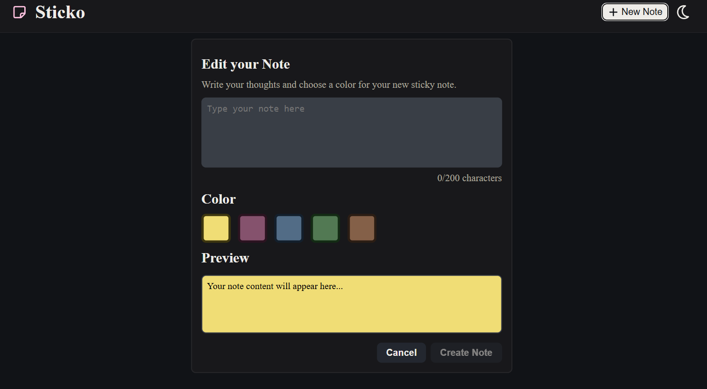

# Sticko - Post it(s)

A website for creating and managing post-its. Using post-its has never been so easy and sustainable as with this website.

## Functionality

### Create post-it(s)

To do this, click on the button in the header or if you have not created one yet, you will be asked to create one with the welcome message

_You can also change the theme in the header._



### Edit notes

Hovering over a note gives you the option to edit the Post-it.

- The pen is for editing the text and color.
- The color palette is there if you just want to change the color
- The trash is, who would have guessed, for deleting.


## How to Clone and Run the Project

1.  First, copy the GitHub download link.

    ```bash
    git clone https://github.com/DigitaleWeltLibrary/sticko-post-it.git
    ```

2.  Then, the repository will be cloned into your directory.

3.  After that, you need to install the Node.js packages.

    ```bash
    npm install
    ```

4.  You're now ready to start the app\!

    ```bash
    npm run dev
    ```

## Used Technologies

- Vite
- React
- FontAwesomeIcon

## Versions

- v1.0.0: Full functionality with UI
- v2.0.0: bug fixes and SEO / Fonts
